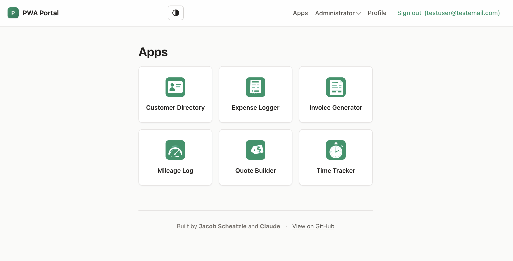
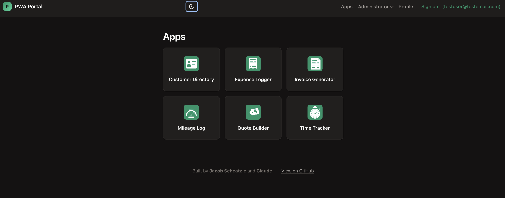
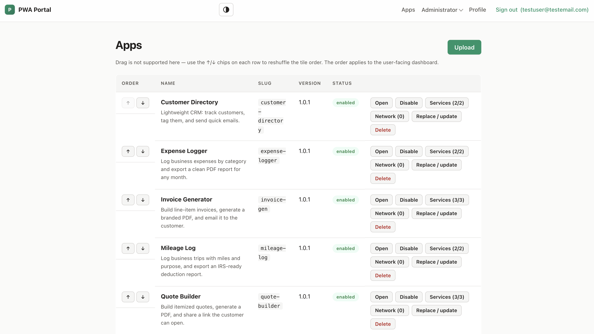

# Progressive WebApp Portal

An open-source, self-hosted **Progressive Web App portal** for small businesses. Deploy it on a small VPS and give your staff a single, installable home for the internal tools they use every day. New tools can be scaffolded, packaged, and uploaded by a non-developer working with Claude.

> **Status:** v1 beta. Single-tenant per deployment. All core building blocks shipped; pre-built container images on GHCR.

## Screenshots

User dashboard — same tiles, light and dark theme follow the system or a per-user toggle:

| Light | Dark |
|---|---|
|  |  |

Admin app management — upload bundles, reorder tiles, gate per-app service and network access, replace in place:



## Why

Most small businesses have a handful of little internal tools — quote builders, receipt emailers, time loggers, lookup utilities — that would be useful if they lived behind a single login on every staff member's phone home screen. Building each tool standalone is heavy; building them on top of an opinionated portal that already handles auth, hosting, PDFs, email, and per-user storage is light.

The portal is designed so the apps inside it can be authored by someone who isn't a developer, working with Claude.

## What's included

- A self-hostable **portal** (FastAPI + SQLite + Caddy in Docker) with:
  - Email/password auth, admin and user roles, server-side session revocation, login rate limiting, self-serve password change
  - PWA manifest + service worker — installable on iPhone home screen
  - Admin pages for staff users, app uploads, SMTP (Fernet-encrypted at rest), API tokens (SHA-256 hashed)
  - JSON HTTP API at `/api/v1/*` with CSRF protection on cookie auth + bearer-token support for automation
  - Alembic-managed schema migrations that run automatically on container start
- **Per-app origin isolation by default.** Each child app runs on its own subdomain (`<slug>.apps.<SITE_URL>`) wrapped in an iframe on the portal — different browser origin, different cookie jar, real isolation between apps. Legacy same-origin fallback available via `CHILD_APPS_SAME_ORIGIN=true` for self-hosters without wildcard DNS.
- A **JavaScript SDK** (`/portal-sdk.js`) automatically available to child apps, handling the cross-origin handshake transparently and exposing:
  - `portal.user.current()` — current signed-in user
  - `portal.pdf.render/download()` — server-rendered PDF via WeasyPrint (SSRF-locked; only `data:` URIs)
  - `portal.email.send()` — outgoing mail with per-user rate limit + optional recipient-domain allowlist
  - `portal.storage.{put,get,list,delete}` — per-app, per-user key/value storage
- A built-in **MCP server** (`/mcp`, admin-token authed, on by default in the image) so Claude connects with a URL + token to **manage apps** (list / upload / replace / enable), **run the tools an app declares**, and **schedule** them. Any app's `portal.json` can expose declarative tools — fill an HTML template → PDF → share / email / store, including itemized line-item documents — that appear to Claude as callable tools. See [docs/mcp.md](docs/mcp.md).
- **Recurring schedules.** Any app tool can run automatically on a daily/weekly/monthly cadence (e.g. an auto-emailed monthly report); its output is delivered through the tool's own action. Managed at **Admin → Schedules** or by Claude over MCP — the portal runs them with or without a Claude connection.
- **Public intake forms.** An app can declare no-sign-in forms served on the app's own origin (`<slug>.apps.<SITE_URL>/forms/<form>`); customer submissions collect under **Admin → Submissions** (with CSV export). The inbound complement to share links — push a PDF out, take structured data in.
- **One-click data export.** A portable, *secret-free* `.zip` of your apps, users, form submissions, schedules, audit log, and per-user storage — open it anywhere, no lock-in (distinct from the full backup, which includes the encrypted database).
- A **Claude skill** ([`claude-skill/pwa-portal-app/`](claude-skill/pwa-portal-app/)) so a non-developer can ask Claude to build an app and have it scaffolded, packaged, and uploaded automatically.
- A **reference gallery** at [`examples/`](https://github.com/jacob-scheatzle/claude-pwa-portal/tree/main/examples) — seven drop-in PWAs (work order, invoice generator, quote builder, time tracker, expense logger, mileage log, customer directory) plus a minimal [`hello-receipt`](https://github.com/jacob-scheatzle/claude-pwa-portal/tree/main/examples/hello-receipt) that exercises every SDK service in one file. Each app also declares **MCP tools** Claude can run; the invoice, quote, and work-order apps render itemized line-item PDFs.
- **Pre-built container images on GHCR** + a GitHub Actions workflow that builds and publishes on every push to `main`. Deployers don't need to clone the repo.
- **Drop in configs for Fail2Ban** It is HIGHLY suggested to use Fail2Ban or something similar to block unwanted connections if using on a VPS or standalone machine. If deploying in a cloud environment it is suggested to use the appropriate security groups, network firewalls, etc. 
## Quick start

Requires a host with **Docker** and **Docker Compose**. The portal ships as two pre-built container images on GitHub Container Registry; you don't need to clone this repo to deploy.

```bash
mkdir my-portal && cd my-portal

# Grab the production compose file + env template
curl -O https://raw.githubusercontent.com/jacob-scheatzle/claude-pwa-portal/main/docker-compose.yml
curl -o .env https://raw.githubusercontent.com/jacob-scheatzle/claude-pwa-portal/main/.env.example

# Edit .env: set SITE_URL and paste a SECRET_KEY
# (generate with: python3 -c "import secrets; print(secrets.token_urlsafe(32))")
nano .env
chmod 600 .env

# Pre-create the data dir owned by uid 1001 (the container's runtime user)
mkdir -p data && sudo chown -R 1001:1001 data

docker compose pull
docker compose up -d
```

Open `https://<your SITE_URL>/` and walk through the first-run wizard to create your admin account.

To upgrade later, run `docker compose pull && docker compose up -d` from the same directory.

If you want to build from source (for development or local patches), `git clone` this repo and run `docker compose up --build -d` — the included `docker-compose.override.yml` auto-merges to build locally instead of pulling.

See [docs/deploying.md](docs/deploying.md) for the full guide: wildcard DNS setup for per-app origin isolation, Caddy auto-HTTPS, domains vs sslip.io, SMTP, backups, hardening checklist, and troubleshooting.

### Deploying to AWS

For a cloud-native deployment, [`aws/`](aws/) ships Terraform that runs the **same image** on **ECS Fargate** behind an **ALB + CloudFront**, with **RDS PostgreSQL**, **S3** object storage, and **WAF**. The DB and blob store are swapped in at runtime via `DATABASE_URL` and `STORAGE_BACKEND=s3` (the `[aws]` extra adds `psycopg` + `boto3`); Caddy runs as an HTTP-only sidecar. See [aws/README.md](aws/README.md) and the AWS notes in [docs/deploying.md](docs/deploying.md).

## Building apps for it

Two paths.

> If your portal runs the MCP server (the default in the Docker image), Claude can also connect to it directly — `claude mcp add --transport http portal <url>/mcp --header "Authorization: Bearer <admin-token>"` — and then manage apps and run their tools as tool calls, no `configure.py` needed. The server even ships an `authoring_guide` tool so an MCP-connected Claude can build apps without the local skill. See [docs/mcp.md](docs/mcp.md).

### With Claude

The skill can be installed for two Claude surfaces. They have different capabilities — pick the one available to you.

#### Path A — Claude Code CLI (full automation, recommended)

If you have [Claude Code](https://claude.com/claude-code) installed locally, the skill scaffolds, packages, **and uploads** apps to your portal automatically — Claude does the whole pipeline.

```bash
bash claude-skill/pwa-portal-app/install.sh
python3 ~/.claude/skills/pwa-portal-app/scripts/configure.py
```

Then in Claude Code, ask:

> *"Make me a quoting tool for my portal — should let me enter line items, generate a PDF, and email it to the customer."*

Claude reads the skill, scaffolds the app, implements your spec, calls `package.py`, and uploads via `upload.py`.

#### Path B — claude.ai web (conversational guide only)

You can also upload the skill to [claude.ai](https://claude.ai) and use it from the web app. **Important limitation:** claude.ai runs skills inside a remote sandbox that has no access to your local machine or your portal's VPS — so the `package.py` and `upload.py` scripts cannot run on your behalf. Claude can generate the `portal.json` and `index.html` for you and tell you the exact commands to run, but **you'll have to run them yourself in a terminal**.

If that fits your workflow:

1. **Download the pre-built skill zip** from the latest release:
   ```bash
   curl -fL -o pwa-portal-app.zip \
     https://github.com/jacob-scheatzle/claude-pwa-portal/releases/latest/download/pwa-portal-app.zip
   ```
   (If you've cloned the repo, you can also build it locally: `cd claude-skill/pwa-portal-app && zip -r ../pwa-portal-app.zip . -x install.sh -x "*.DS_Store" -x "__pycache__/*"`.)
2. **Upload to claude.ai:** in the claude.ai web app, open **Settings → Features → Skills → +** → **Upload a skill** → select `pwa-portal-app.zip`.
3. **Use it:** in any chat, prompt Claude to build something for the portal — the skill name (`pwa-portal-app`) primes Claude to follow the conventions in `SKILL.md`. Claude will give you the file contents and the terminal commands; you paste them.

See [`claude-skill/pwa-portal-app/SKILL.md`](claude-skill/pwa-portal-app/SKILL.md) for the full skill content — same on both surfaces.

### Manually

See [docs/app-authoring.md](docs/app-authoring.md) for the full `portal.json` schema, file layout, SDK usage, and the packaging/upload commands. For the wire-level API, see [docs/api-reference.md](docs/api-reference.md).

## Project layout

Selected files (not exhaustive — see [CLAUDE.md](CLAUDE.md) for the full
module map, including `access.py`, `audit.py`, `branding.py`, `forms.py`,
`health.py`, `scheduler.py`, `shares.py`):

```
portal/                  FastAPI portal app
  main.py                  App factory, lifespan, auth routes, /profile, login rate limit
  api.py                   /api/v1/* — JSON API (PDF, email, storage, user, csrf-token,
                             session/exchange, apps/upload, internal/cert-ask)
  apps.py                  Child-app upload, validation, extraction, serving (portal +
                             subdomain paths)
  admin.py                 /admin/{settings,tokens,users}
  mcp_server.py            /mcp MCP server — app management + each app's declared tools (optional)
  oauth.py                 OAuth 2.1 AS for the /mcp connector (claude.ai can't use static tokens)
  app_tools.py             Executor for app-declared tools (template → PDF → share/email/store)
  middleware.py            HostDispatchMiddleware — sets request.state.app_slug from Host
  models.py                SQLModel tables: User, Setting, App, ApiToken, UserSession,
                             AppLaunchToken, AppSession
  sessions.py              Server-side session helpers + AppSession lifecycle
  smtp.py                  SMTP send helper (used by /email/send + admin test)
  settings_store.py        Setting key/value helpers + Fernet-encrypted secrets
  storage_backend.py       Pluggable blob store: LocalStorageBackend (data_dir) | S3StorageBackend
  security.py              bcrypt, password validation, csrf_token + check_csrf
  deps.py                  FastAPI deps: current_user, current_user_or_token, require_admin
  config.py                Pydantic Settings (env)
  db.py                    Engine + Alembic-driven init_db
  web.py                   Shared Jinja templates + render() helper
  cli.py                   `python -m portal.cli {list-users,reset-password EMAIL}`
  templates/               Jinja2 — base, dashboard, login, setup, profile, admin_*,
                             app_launcher
  static/                  sw.js, manifest.webmanifest, portal-sdk.js, default icons
alembic/                 Migration scripts + Alembic env
claude-skill/
  pwa-portal-app/          Drop-in Claude skill — SKILL.md + scaffolding + scripts
examples/
  hello-receipt/           Reference child app exercising every SDK service
docs/                    Deployment, app authoring, API reference, MCP server,
                           fail2ban, project-state, per-app-origin-design
.github/workflows/       CI: build + push images to GHCR on push to main / v* tags
docker-compose.yml       Production compose (pulls from GHCR; no source needed)
docker-compose.override.yml  Dev override — auto-merges to build locally
Dockerfile               Portal image (Python + WeasyPrint deps + non-root user)
Dockerfile.caddy         Caddy image with Caddyfile baked in
Caddyfile                Reverse proxy: portal origin + wildcard *.apps.<SITE_URL>
                           with on-demand TLS
.env.example             Configuration template
pyproject.toml           Python dependencies (managed via Alembic for schema)
CLAUDE.md                Codebase context loaded by Claude Code sessions
```

## Architecture decisions

- **Single-tenant per deployment.** One business per portal instance. Multi-tenant SaaS is explicitly not a goal — every small business self-hosts.
- **Per-app origin isolation.** Each child app runs at `<slug>.apps.<SITE_URL>` (its own browser origin), embedded in an iframe rendered at `/apps/<slug>/` on the portal origin. Browser same-origin policy is the actual security boundary between apps. Caddy fetches Let's Encrypt certs on demand per subdomain (HTTP-01); a single wildcard DNS A record is all the operator needs. Legacy same-origin mode (`CHILD_APPS_SAME_ORIGIN=true`) remains for self-hosters who can't configure wildcard DNS — with a warning banner in the admin UI.
- **Server-side Python services.** PDF (WeasyPrint), email (SMTP), and per-user storage are server endpoints; child apps are HTML/CSS/JS that call them through the SDK. Keeps a small VPS happy and lets non-coders ship working tools.
- **MCP as a transport, not a new privilege.** The built-in MCP server lets Claude manage apps and run each app's declared tools over the same admin-token API that already exists. App tools are *declarative* (template → PDF → deliver) and run by composing the portal's own services — uploaded code never executes server-side, so the per-app-origin trust model is untouched. On by default in the image; `MCP_ENABLED=false` removes the endpoint.
- **Env as the source of truth for routing.** `SITE_URL` and `SECRET_KEY` come from `.env`; Caddy reads the same value at boot, the portal won't start with a placeholder secret if `SITE_URL` isn't `localhost`. SMTP credentials are admin-editable from the UI (Fernet-encrypted at rest in SQLite).
- **Stdlib-only Claude skill tooling.** `package.py` and `upload.py` use only the Python standard library (`urllib`, `zipfile`), so they work anywhere Python 3.11+ runs.
- **No frontend build step in the portal.** Server-rendered Jinja templates with light POST forms — no React, no Vue, no bundler. Easier for non-coders to read, fork, and patch.
- **Schema evolution via Alembic.** New tables and column changes ship as migrations that run automatically on container start; existing dev/prod DBs created via `SQLModel.metadata.create_all` are auto-stamped on first boot.
- **Containers built in CI, pulled at deploy.** Two images (`claude-pwa-portal`, `claude-pwa-portal-caddy`) published to GHCR on every push to `main`. Deployers download two files (compose + env) and run `docker compose up -d`.

## License

**[GNU Affero General Public License v3.0](LICENSE)** (AGPL-3.0). Full text in [`LICENSE`](LICENSE).

In plain terms:

- Forking, modifying, and self-hosting for your own business is fine.
- If you modify the portal and **run it as a network service** that others can interact with (the obvious commercialization path here), AGPL-3.0 requires you to release **your full modified source** under the same AGPL terms to anyone who uses the service. This is the "Affero clause" — it closes the SaaS loophole the regular GPL leaves open.
- No warranty. The license disclaims all liability.

The practical effect: hobbyist forks and internal-business use are unaffected; anyone trying to turn this into a closed-source SaaS product would have to publish their work, which most companies refuse to do. If your use case requires a commercial license without the AGPL obligations, contact the author.

## Contributing

This is an early project. Issues and PRs welcome. By contributing, you agree your contributions are licensed under the same AGPL-3.0 terms. Skim the architectural notes above before proposing significant structural changes.
